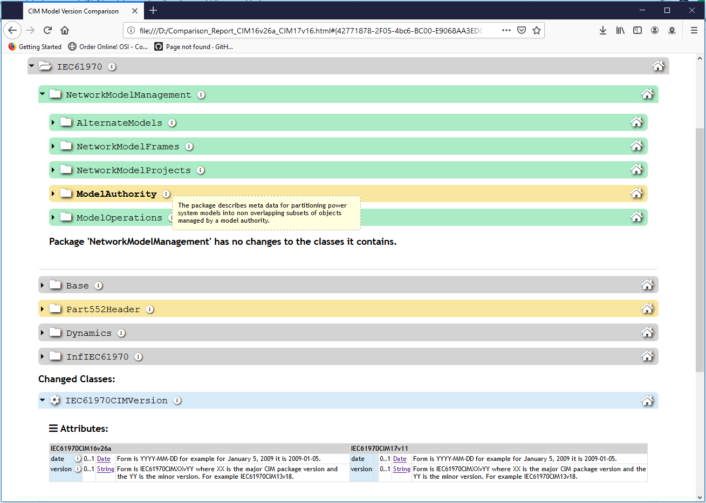
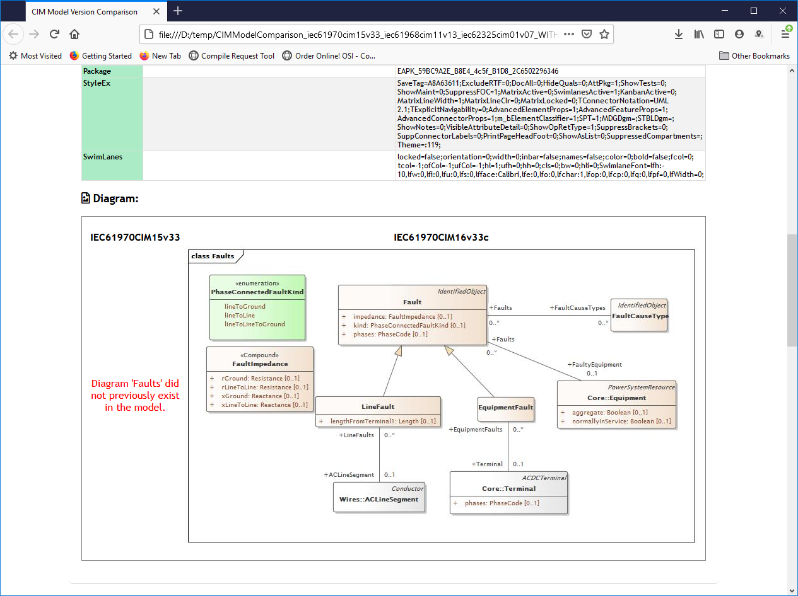

# cim-compare

>   Command line tool for generating CIM model comparison reports.

## CIM Model Comparison Report Utility

**cim-compare** generates model comparison reports between two points in time. A link to the latest release can be found at the end of this README.

The term “target” is used to describe some current version (or latest working copy) of a CIM model that is to be the target of the comparison. The term “baseline” is used to describe the **historical** model against which the “target” model is to be compared to determine what has changed.

Enterprise Architect (Corporate Edition and above) has the capability to perform these model comparisons; however, the feature is not generally useful as results are only exportable as XML files that are not easily human readable.

The output generated by **cim-compare** results in a self-contained HTML comparison report of all changes between a “baseline” and “target” model. The report is viewable in most standard browsers such as Firefox, Chrome, IE, etc. and provides the ability to search for specific CIM classes within the report.

Reports use colors to visually indicate changes to packages, classes, attributes, generalizations, and associations. New items are shown in green, deleted items in red, items that have moved location within the model appear as yellow, blue represents items that were changed in some way, and violet indicates items that are unchanged.



As illustrated next, UML diagrams that have been added, removed or modified can also be included in comparison reports. To include diagrams refer to the XMI Export Procedures further down.



## Enterprise Architect XMI Export Procedures

The procedure to perform an export of EA baseline and target models as **XMI 1.1** compliant files is as follows (screenshots taken from EA v15.1):

1.  In Enterprise Architect load the “baseline” (or older) model and select the top-level package of the model as shown.

   <p align="left">
      
   </p>

2.  Once selected, choose the Publish menu and then the “Other Formats…” menu.

   <p align="left">
      
   </p>

3. The dialog box shown next will be presented to allow selection of the specific settings to use for export.  Select the **“UML 1.3 (XMI 1.1)”** XML export type.  This is the only export format supported for **cim-compare** comparison reports. It is important that the "Unisys/Rose Format" option **not** be checked. Finally, the inclusion of UML diagrams in the comparison report can optionally be selected at this time. This is done by additionally checking the "Export Diagrams" and "Generate Diagram Images" check boxes along with the selection of JPG as the format to export the images in. Note that when including UML diagrams as part of the export EA will automatically create a directory called "Images" and export all JPG files into that directory.

   <p align="left">
      
   </p>

4. Finish out by selecting a target directory along with a file name for the "Filename" field.  

5. Click the **Export** button. Note that at this point it will take a while for the export to complete.

6. If UML diagrams were included then upon completion of the export you should navigate to the export directory and rename the diagrams directory from "Images" to "Images-baseline". The naming convention is important and must match what is indicated here including case-sensitivity.

7. Now close out of the baseline model load the target model into EA and perform Steps 1 through 6 again but this time be sure to enter a different name into the "Filename" field for the target XMI file to be exported. Upon completion the target model's "Images" directory should be renamed to "Images-target".

8. The result should be a final export directory containing two images directories (i.e. "Images-baseline" and "Images-target" containing the baseline and target diagrams respectively) and two distinct XMI files to be used as input on the command line to **cim-compare**.


## Command Line Usage

The **cim-compare** utility has two possible command-line options to produce comparison reports as described next.

### Option \#1: XMI Baseline and Target Models as Inputs

The preferred usage is to directly specify two XMI 1.1 compliant files representing the "baseline" and "target" models exported as previously described in "Enterprise Architect XMI Export Procedures". In this scenario the command-line usage takes the following form:

```
java -jar cim-compare.jar <baseline-model-xmi-file> <target-model-xmi-file> [<output-directory-or-html-file>] [--package=<iec-package-name>] [--minimal]
```

*Parameter Details*:

**\<baseline-model-xmi-file\>** (**Required**): An XMI 1.1 compliant baseline model file exported from EA. When not specified as an absolute file path the location of the file is assumed to be the directory the utility is being executed from.

**\<target-model-xmi-file\>** (**Required**): An XMI 1.1 compliant target model file exported from EA. When not specified as an absolute file path the location of the file is assumed to be the directory the utility is being executed from.

**[\<output-directory-or-html-file\>] (Optional)**: An output directory or an output HTML file. In the case where a directory is specified for this parameter it must exist or execution will terminate with an appropriate error. When an HTML file is provided it may be specified as an absolute file path or as simply the name of the HTML file to be generated. If not specified then the application will generate an HTML file whose name is derived from the two input files.

**[--package=\<iec-package-name\>] (Optional):** The root package within the models from which to start the comparison report from. Appearing at the end of the command-line after file and directory specifications, when specified the package must exist in both the baseline and target models (e.g. --package=IEC61970, --package=IEC61968, --package=IEC62325, --package=TC57CIM, etc.) and be specified with two leading dashes (--). Note that when no IEC package name is specified that the report is generated from the root package in the models.

**[--minimal] (Optional):** When specified **cim-compare** will exclude all "Identical" packages, classes, attributes, links, diagrams, etc. from the generated report. This is useful when it is necessary to perform detailed analysis of only the most concise set of changes between models.

Note that in command line examples that follow whenever a directory or file path contains spaces it is specified within quotes.

| **Command Line Examples:**                                                                               |
|----------------------------------------------------------------------------------------------------------|
| java -jar **cim-compare.jar** "C:\\XMI exports\\15v33.xmi" "C:\\XMI exports\\CIM16v26a.xmi" "C:\\" |
| java -jar **cim-compare.jar** "C:\\XMI exports\\15v33.xmi" "C:\\XMI exports\\CIM16v26a.xmi" --package=IEC61970 --minimal |
| java -jar **cim-compare.jar** CIM15v33.xmi CIM16v26a.xmi C:\\ --minimal  |
| java -jar **cim-compare.jar** CIM15v33.xmi CIM16v26a.xmi C:\\CIM15v33_CIM16v26a_ComparisonReport.html |
| java -jar **cim-compare.jar** CIM15v33.xmi CIM16v26a.xmi CIM15v33_CIM16v26a_ComparisonReport.html --minimal |
| java -jar **cim-compare.jar** CIM15v33.xmi CIM16v26a.xmi CIM15v33_CIM16v26a_ComparisonReport.html --package=IEC62325 |

### Option \#2: EA Model Comparison Logs as Input

The second option is by specifying an **EA model comparison log** file as input on the command line. In order to perform this option it is first required that a comparison XML log file be generated from within Enterprise Architect.  Refer to the [EA Comparison Log Procedures](EA_COMPARE_PROCEDURES.md) for detailed information on generating XML Compare Logs from within Enterprise Architect. It is important to note that EA does not support comparisons of UML diagrams and therefore diagrams are not supported as part of reports generated using Option \#2.

This particular usage takes the following form:

```
java -jar cim-compare.jar <comparison-results-xml-file> [<output-directory-or-html-file>] [--package=<iec-package-name>] [--minimal]
```

*Parameter Details*:

**\<comparison-results-xml-file\> (Required):** The model comparison file. When not specified as an absolute file path the location of the file is assumed to be the directory the utility is being executed in.

**[\<output-directory-or-html-file\>] (Optional):** An output directory or an output HTML file. In the case where a directory is specified for this parameter it must exist or execution will terminate with an appropriate error. When an HTML file is provided it may be specified as an absolute file path or as simply the name of the HTML file to be generated. If not specified then the application will generate an HTML file whose name is derived from the two input files.

**[--package=\<iec-package-name\>] (Optional):** The root package to compare and generate the comparison report on. Appearing at the end of the command-line after file and directory specifications, the package must exist in both the baseline and target models (e.g. --package=IEC61970, --package=IEC61968, --package=IEC62325, --package=TC57CIM, etc.) and be specified with two leading dashes (--). Note that when no IEC package name is specified that the report is generated from the root package in the models.

**[--minimal] (Optional):** When specified **cim-compare** will exclude all "Identical" packages, classes, attributes, links, diagrams, etc. from the generated report. This is useful when it is necessary to perform detailed analysis of only the most concise set of changes between models.

Again, in the command line examples that follow directory or file path containing spaces are specified within quotes.

| **Command Line Examples:**                                                                                |
|-----------------------------------------------------------------------------------------------------------|
| java -jar **cim-compare.jar** "C:\\CIM XMI Exports\\CIM15v33_CIM16v26a_EA_Comparison_Report.xml" "C:\\Reports" |
| java -jar **cim-compare.jar** CIM15v33_CIM16v26a_EA_Comparison_Report.xml "C:\\Comparison Reports" --minimal |
| java -jar **cim-compare.jar** CIM15v33_CIM16v26a_EA_Comparison_Report.xml "C:\\Comparison Reports" --package=IEC61968 |
| java -jar **cim-compare.jar** CIM15v33_CIM16v26a_EA_Comparison_Report.xml ComparisonReport_CIM15v33_CIM16v26a.html |
| java -jar **cim-compare.jar** CIM15v33_CIM16v26a_EA_Comparison_Report.xml|
| java -jar **cim-compare.jar** CIM15v33_CIM16v26a_EA_Comparison_Report.xml --package=IEC61970|
| java -jar **cim-compare.jar** CIM15v33_CIM16v26a_EA_Comparison_Report.xml --package=IEC61970 --minimal|

## Java Technical Requirements

**cim-compare** ships as a fully self-contained executable jar file with no external dependencies.  It has been tested and confirmed to run successfully using Java 1.8  through Java 12.

Given the large file sizes consumed and produced by the utility, **OutOfMemory** exceptions occur if the default heap size is used. The following guidelines should be followed:

> For a 32-bit JRE it is recommended to specify a max heap size of at least 1G
    (i.e. 1024m) resources permitting. With a 1G heap size the execution will
    typically run a little slower. Note that the maximum theoretical heap limit
    for a 32-bit JVM is 4G. However, due to various additional constraints such
    as available swap, kernel address space usage, memory fragmentation, and VM
    overhead, in practice the limit can be much lower. On most modern 32-bit
    Windows systems the maximum heap size will range from 1.4G to 1.6G.

java <span style="color:red">-mx1024m</span> -jar **cim-compare.jar** iec61970cim16v26a.xmi iec61970cim17v16.xmi D:\\reports

> For 64 bit JREs it is recommended that the maximum heap size be increased to at least 2G (i.e. 2048m) if available. It has been observed that 2G is usually sufficient to handle the largest CIM files one might encounter.

java <span style="color:red">-mx2048m</span> -jar **cim-compare.jar** iec61970cim16v26a.xmi iec61970cim17v16.xmi D:\\reports


## Latest Release

-   1.1.0  

    -   The latest release is available at [cim-compare-1.1.0](https://github.com/CIMug-org/cim-compare/releases/tag/1.1.0).
    -   Information on features and fixes for the release can be found [here](https://cimug-org.github.io/cim-compare/).

## License

Distributed under the MIT license. See [LICENSE](LICENSE) for more information.
